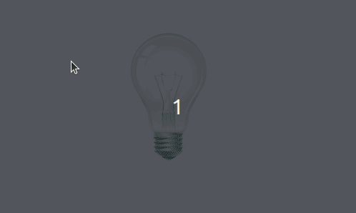

> [English version](README.md) 

# DESAFIO 01

- crie um arquivo html contendo uma tag de imagem
- quando carregado o arquivo deve exibir a imagem da lampada apagada
- quando clicar na lâmpada deve ficar alternando a cada clique a imagem da lampada acesa e apagada

[DESAFIO 02](../challenge-2/README-PTBR.md)  
[Voltar](../README-PTBR.md)