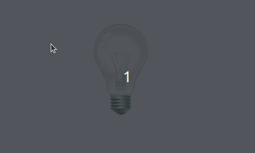

> [pt-br version](README-PTBR.md)

# CHALLENGE 01

- create an html file containing an image tag
- when loaded the file should display the image of the light off
- when you click on the lamp, the image of the lamp on and off should be alternating with each click

[CHALLENGE 02](../challenge-2/README.md)  
[Back](../README.md)