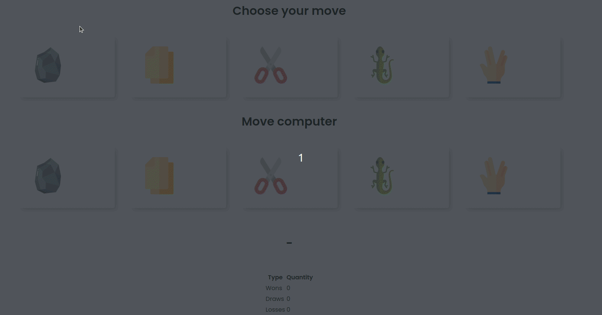

> [English version](README.md) 

# DESAFIO 02

- adicionar as opções "lagarto" e "spock", sendo que:
    - jogadas iguais => empate
    - pedra < papel
    - pedra > tesoura
    - pedra > lagarto
    - pedra < spock

    - papel > pedra
    - papel < tesoura
    - papel < lagarto
    - papel > spock

    - tesoura > papel
    - tesoura < pedra
    - tesoura > lagarto
    - tesoura < spock

    - lagarto > papel
    - lagarto < pedra
    - lagarto < pedra
    - lagarto > spock

    - spock < papel
    - spock > pedra
    - spock < lagarto
    - spock > tesoura

[DESAFIO 1](../challenge-1/README-PTBR.md)  
[Voltar](../README-PTBR.md)