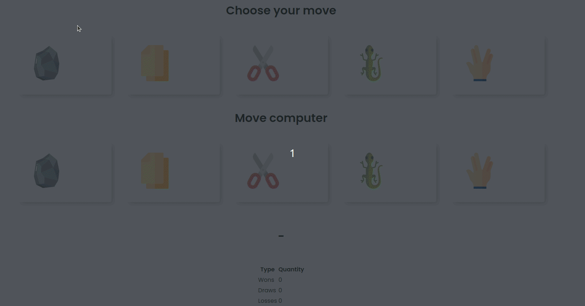

> [pt-br version](README-PTBR.md)

# CHALLENGE 02

- add the options "lizard" and "spock", where:
    - equal moves => draw
    - stone < paper
    - rock > scissors
    - stone > lizard
    - stone < spock

    - paper > stone
    - paper < scissors
    - paper < lizard
    - paper > spock

    - scissors > paper
    - scissors < stone
    - scissors > lizard
    - scissors < spock

    - lizard > paper
    - lizard < stone
    - lizard < stone
    - lizard > spock

    - spock < paper
    - spock > stone
    - spock < lizard
    - spock > scissors
    

[CHALLENGE 1](../challenge-1/README.md)  
[Back](../README.md)