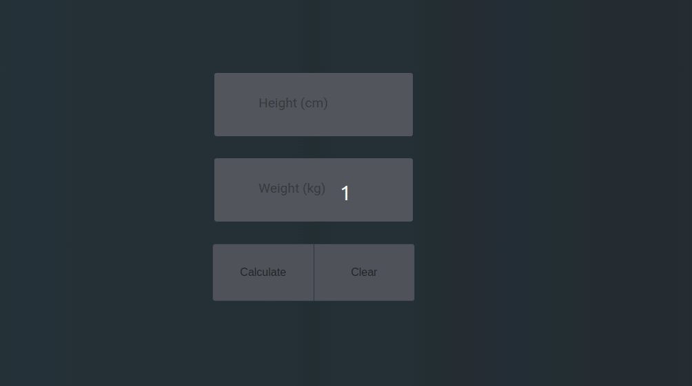
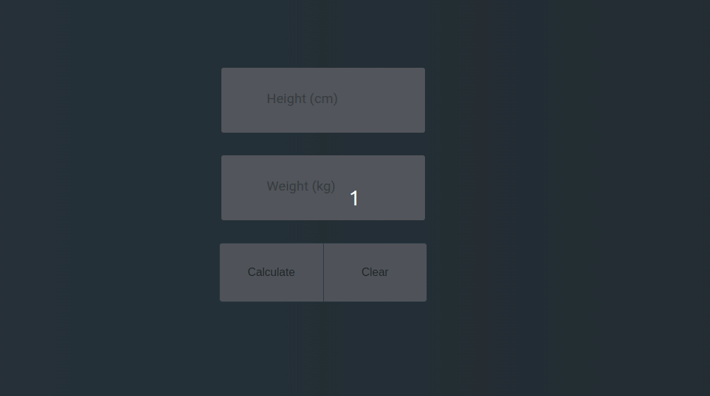

> [English version](README.md)


# AULA

- crie um arquivo html, no arquivo deve conter
    - 1 input do tipo ```number``` para a altura
    - 1 input do tipo ```number``` para a peso
    - 1 botão com o texto "calcular"
    - 1 botão com o texto "limpar"
- ao clicar no botão "calcular" deve pegar o valor do input de altura e o de peso e fazer o cálculo (altura x altura / peso)
- ao clicar no botão "limpar" deve remover os dados dos inputs e do output



# [DESAFIO 01](./challenge-1/README-PTBR.md)

- ao clicar no botão "calcular" deve pegar o valor do input de altura e o de peso e fazer o cálculo (altura x altura / peso) 
- e também deve aparecer o tipo conforme:
```
< 16 deve mostrar 'Severe Thinness'
> 16 && <= 17 deve mostrar 'Moderate Thinness'
> 17 && <= 18.5 deve mostrar 'Mild Thinness'
> 18.5 && <= 25 deve mostrar 'Normal'
> 25 && <= 30 deve mostrar 'Overweight'
> 30 && <= 35 deve mostrar 'Obese Class I'
> 35 && <= 40 deve mostrar 'Obese Class II'
```
- ao clicar no botão "limpar" deve remover os dados dos inputs e do output



# [DESAFIO 02](./challenge-2/README-PTBR.md)

- ao clicar no botão "calcular" deve pegar o valor do input de altura e o de peso e fazer o cálculo (altura x altura / peso)
- e também deve aparecer o tipo conforme o desafio1
    * obs: caso seja "normal" deve mostrar em verde, caso contrário em vermelho
- também deve mostrar o "peso ideal" (22,5 IMC)
    * deve demonstrar a diferença do peso ideal para o "peso ideal"
- ao clicar no botão "limpar" deve remover os dados dos inputs e do output


[Voltar](../README-PTBR.md)