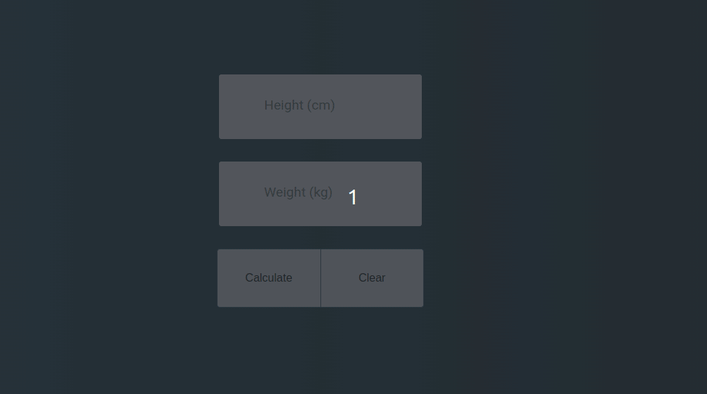
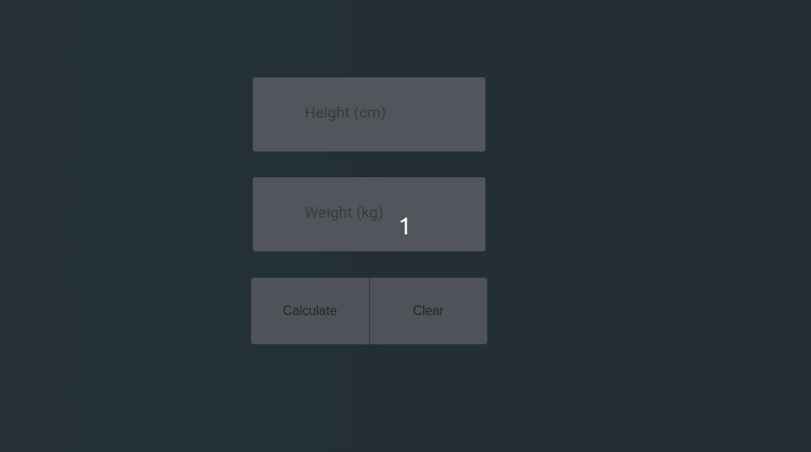
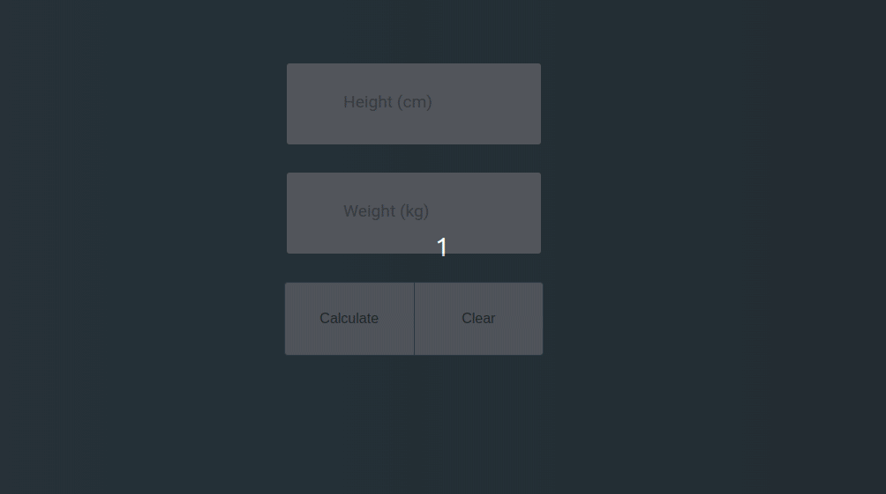

> [pt-br version](README-PTBR.md)


# CLASS

- create an html file, in the file must contain
    - 1 input of type ```number``` for height
    - 1 input of type ```number``` for weight
    - 1 button with the text "calculate"
    - 1 button with the text "clear"
- when clicking on the "calculate" button, you must take the height and weight input value and make the calculation (height x height / weight)
- by clicking on the "clear" button, you must remove the data from the inputs and the output



# [CHALLENGE 01](./challenge-1/README.md)

- when clicking on the "calculate" button, you must take the height and weight input value and make the calculation (height x height / weight)
- and the type must also appear as:
```
< 16 should show 'Severe Thinness'
> 16 && <= 17 should show 'Moderate Thinness'
> 17 && <= 18.5 should show 'Mild Thinness'
> 18.5 && <= 25 should show 'Normal'
> 25 && <= 30 should show 'Overweight'
> 30 && <= 35 should show 'Obese Class I'
> 35 && <= 40 should show 'Obese Class II'
```
- by clicking on the "clear" button, you must remove the data from the inputs and the output



# [CHALLENGE 02](./challenge-2/README.md)

- when clicking on the "calculate" button, you must take the height and weight input value and make the calculation (height x height / weight)
- and the type should also appear according to the challenge1
    * obs: if it is "normal" it must show in green, otherwise in red
- must also show "ideal weight" (22.5 BMI)
    * must demonstrate the difference between ideal weight and "ideal weight"
- by clicking on the "clear" button, you must remove the data from the inputs and the output



[Back](../README.md)