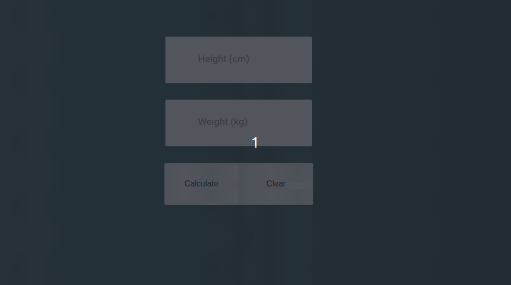

> [English version](README.md) 

# DESAFIO 02

- ao clicar no botão "calcular" deve pegar o valor do input de altura e o de peso e fazer o cálculo (altura x altura / peso)
- e também deve aparecer o tipo conforme o desafio1
    * obs: caso seja "normal" deve mostrar em verde, caso contrário em vermelho
- também deve mostrar o "peso ideal" (22,5 IMC)
    * deve demonstrar a diferença do peso ideal para o "peso ideal"
- ao clicar no botão "limpar" deve remover os dados dos inputs e do output

[DESAFIO 1](../challenge-1/README-PTBR.md)  
[Voltar](../README-PTBR.md)