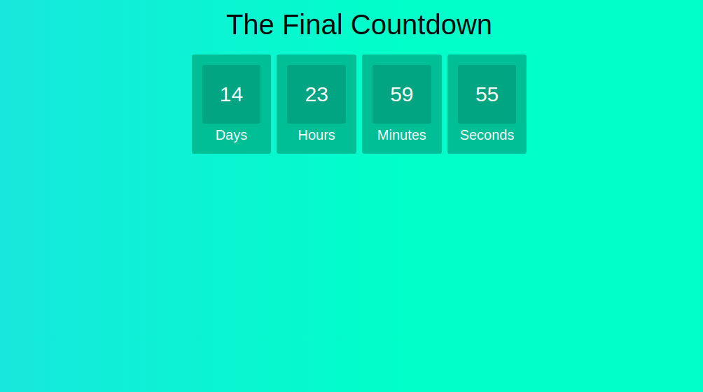

> [English version](README.md)


# AULA

- crie um arquivo html, no arquivo deve conter
    - h1 com título
    - 1 div com id clock e dentro dela div para dia, hora, minutos e segundos como no exemplo:
```
<div>
    <span id="days"></span>
    <div class="text">Days</div>
</div>
```
- quando carregar a página deve comentar a contagem regressiva



# DESAFIO 01

- adicionar div e funcionalidade para mês e ano


# DESAFIO 02

- adicionar input do tipo "datetime-local" para selecionar uma data e hora
- adicionar um botão "start" que quando clicado comece a fazer a contagem regressiva
- BONUS: quando carregar a página deixe as propriedades do input (value e min) com a data atual


[Voltar](../README-PTBR.md)