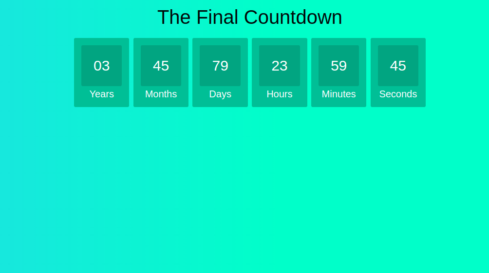

> [English version](README.md)


# CLASS

- create an html file, in the file must contain
    - h1 with title
    - 1 div with clock id and inside it div for the day, hour, minutes, and seconds as in the example:
```
<div>
    <span id="days"></span>
    <div class="text">Days</div>
</div>
```
- when loading the page must comment the countdown


# CHALLENGE 01

- add div and functionality for month and year



# CHALLENGE 02

- add input of type "datetime-local" to select a date and time
- add a "start" button that when clicked starts counting down
- BONUS: when loading the page, leave the input properties (value and min) with the current date


[Back](../README-PTBR.md)