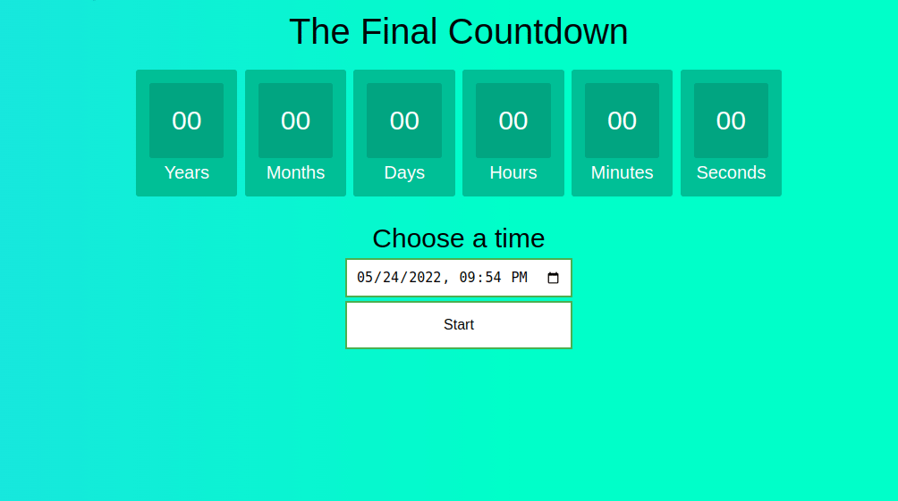

> [English version](README.md) 

# DESAFIO 02

- adicionar input do tipo "datetime-local" para selecionar uma data e hora
- adicionar um botão "start" que quando clicado comece a fazer a contagem regressiva
- BONUS: quando carregar a página deixe as propriedades do input (value e min) com a data atual

[DESAFIO 1](../challenge-1/README-PTBR.md)  
[Voltar](../README-PTBR.md)