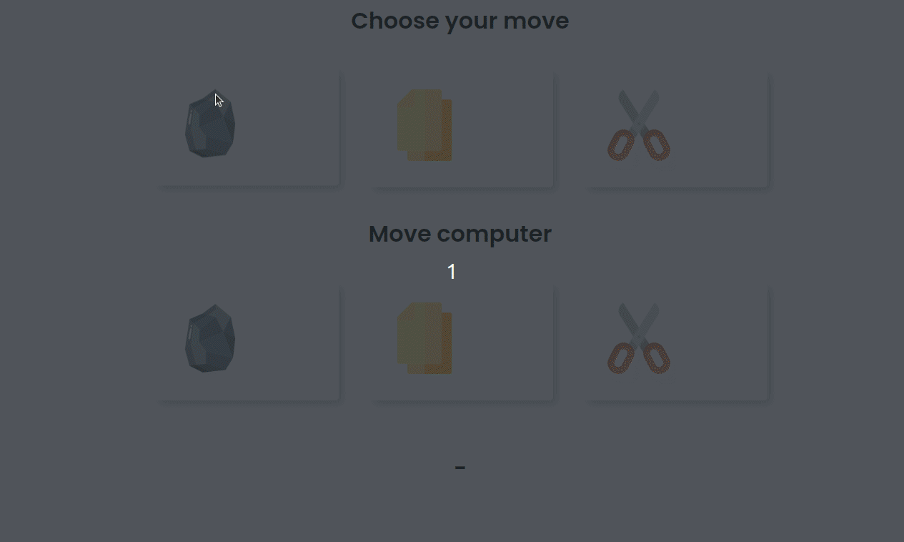
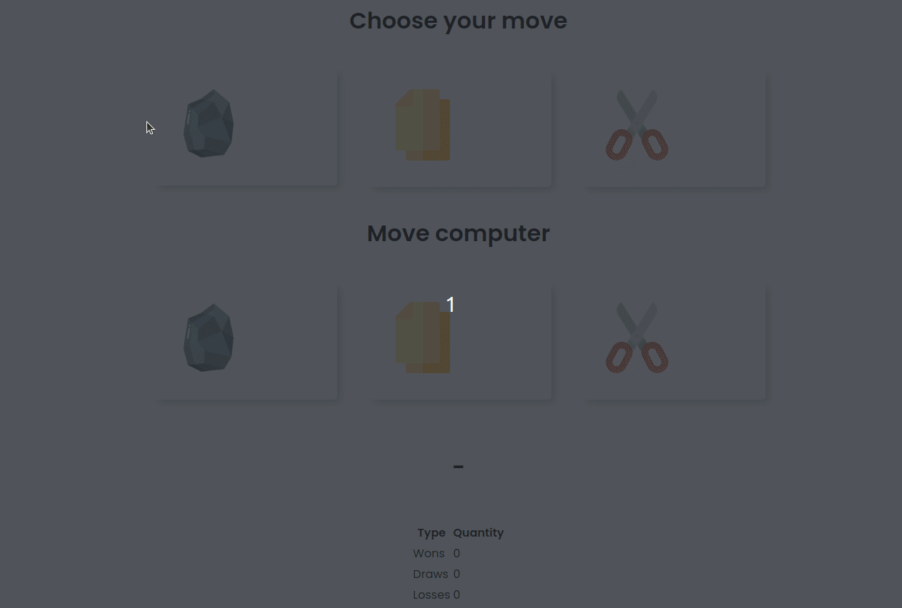
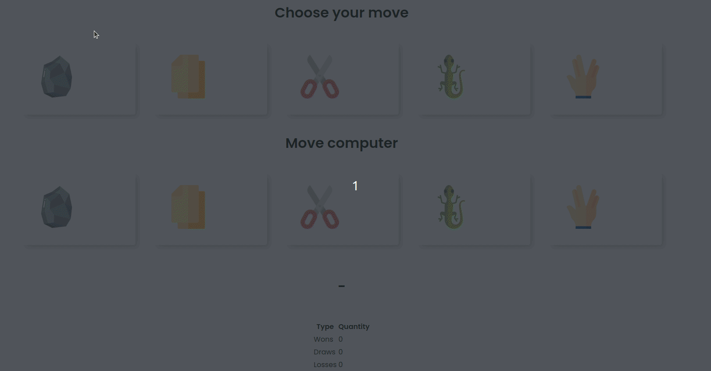

> [English version](README.md)

# AULA

- crie um arquivo html no arquivo deve conter
    - 3 cards
    - 1 card para pedra
    - 1 card para papel
    - 1 card para tesoura
    - uma mensagem de quem ganhou, perdeu ou empate
- quando clicar em um dos cards, essa será escolhida a jogada do jogador
- deve ser escolhida aleatoriamente uma jogada para o computador
- deve mostrar quem ganhou ou perdeu, ou se foi empate, seguindo a lógica
    - jogadas iguais => empate
    - pedra < papel
    - pedra > tesoura

    - papel > pedra
    - papel < tesoura

    - tesoura > papel
    - tesoura < pedra

# DESAFIO 01

- adicionar uma tabela que contenha os resultados de vitórias, empates e derrotas do jogador

# DESAFIO 02

- adicionar as opções "lagarto" e "spock", sendo que:
    - jogadas iguais => empate
    - pedra < papel
    - pedra > tesoura
    - pedra > lagarto
    - pedra < spock

    - papel > pedra
    - papel < tesoura
    - papel < lagarto
    - papel > spock

    - tesoura > papel
    - tesoura < pedra
    - tesoura > lagarto
    - tesoura < spock

    - lagarto > papel
    - lagarto < pedra
    - lagarto < pedra
    - lagarto > spock

    - spock < papel
    - spock > pedra
    - spock < lagarto
    - spock > tesoura

[Voltar](../README-PTBR.md)