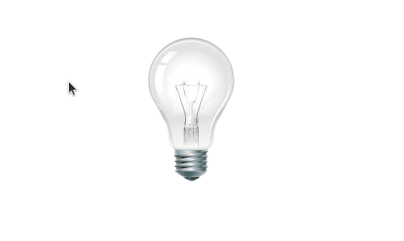
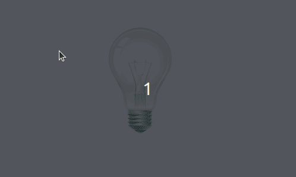
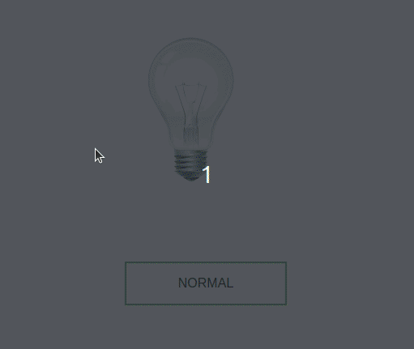

> [English version](README.md) 

# AULA

- crie um arquivo html no arquivo deve conter
    - a imagem
- quando carregado o arquivo deve exibir a imagem da lampada apagada
- se lâmpada deve ser acesa quando passar o mouse em cima, desligar quando tirar o mouse de cima da lâmpada e "quebrar" quando clicar e assim permanecer

# [DESAFIO 01](./challenge-1/README-PTBR.md)

- crie um arquivo html contendo uma tag de imagem
- quando carregado o arquivo deve exibir a imagem da lampada apagada
- quando clicar na lâmpada deve ficar alternando a cada clique a imagem da lampada acesa e apagada

# [DESAFIO 02](./challenge-2/README-PTBR.md)

- crie um arquivo html no arquivo deve conter
    - a imagem
    - um botão
- quando carregado o arquivo deve exibir a imagem da lampada apagada
- o botão deve ficar alterando o texto sempre que clicado de "NORMAL" para "SWITCH"
- se o botão estiver com o texto "NORMAL" a lâmpada deve ser acesa quando passar o mouse em cima, desligar quando tirar o mouse de cima da lâmpada e "quebrar" quando clicar e assim permanecer
- se o botão estiver com o texto "SWITCH", quando clicar na lâmpada deve ficar alternando a cada clique a imagem da lampada acesa e apagada

[Voltar](../README-PTBR.md)