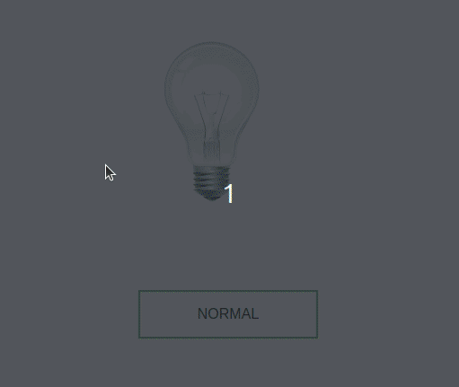

> [pt-br version](README-PTBR.md)

# CLASS

- create an html file in the file must contain
    - the image
- when loaded the file should display the image of the light off
- if the lamp should be lit when hovering the mouse over it, turn off when taking the mouse off the lamp and "break" when clicking and remain so

# [CHALLENGE 01](./challenge-1/README.md)

- create an html file containing an image tag
- when loaded the file should display the image of the light off
- when you click on the lamp, the image of the lamp on and off should be alternating with each click

# [CHALLENGE 02](./challenge-2/README-PTBR.md)

- create an html file in the file must contain
    - the image
    - a button
- when loaded the file should display the image of the light off
- the button must keep changing the text whenever clicked from "NORMAL" to "SWITCH"
- if the button has the text "NORMAL" the lamp must be lit when you hover over it, turn off when you take the mouse off the lamp and "break" when you click and remain so
- if the button has the text "SWITCH", when you click on the lamp, the image of the lamp on and off should be alternating with each click

  
[Back](../README.md)