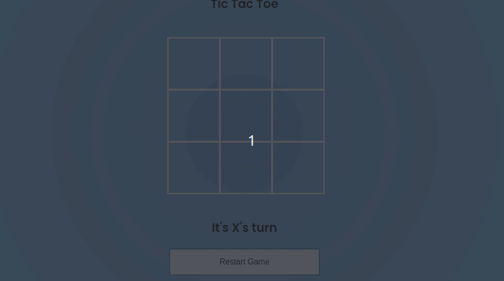
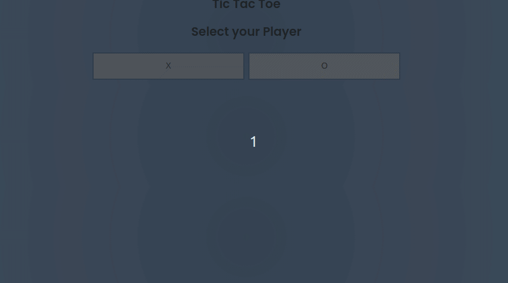

> [English version](README.md)

# AULA

- Crie um arquivo html com 9 quadrados (3 linhas com 3 quadrados) e um botão de "reiniciar o jogo"
- o "X" deve começar o jogo
- quando clicar dentro de um quadrado que não estiver preenchido deve preencher com a jogada, alternando entre "X" e "O"
- quando clicar dentro de um quadrado preenchido não deve contabilizar a jogada
- caso algum jogador consiga fazer 3 jogadas consecutivas em linha, coluna ou transversal deve mostrar esse jogador como vencedor
- caso nenhum termine as jogadas e nenhum jogador consiga fazer as jogadas para vencer, deve ser mostrado "empate" 
- quando clicar em "reiniciar o jogo" deve mostrar o estado inicial (quadro limpo e vez do jogador "X")

# [DESAFIO 01](./challenge-1/README-PTBR.md)

- adicionar jogada do computador:
    - deve ser o  jogador  "O"
    - deve executar sempre depois da jogada do jogador
    - deve ser apenas jogadas válidas

# [DESAFIO 02](./challenge-2/README-PTBR.md)

- Adicionar a opção de selecionar o jogador:
    - o quadro com as opções de clicar deve ficar escondido inicialmente
    - deve aparecer inicialmente dois botões para selecionar o "player"
    - quando selecionado um player, deve esconder o "menu" de selecionar o jogador e mostrar o board
    - quando clicar em "reiniciar o jogo" deve mostrar o estado inicial (tela de selecionar o player)
    - caso selecione o "O" o PC deve fazer sua jogada primeiro

[Voltar](../README-PTBR.md)