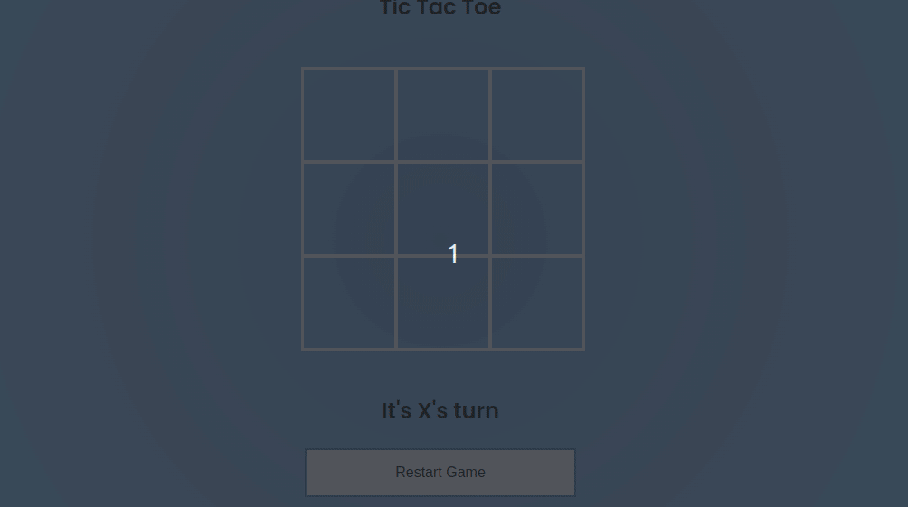

> [pt-br version](README-PTBR.md)

# CLASS

- Create an html file with 9 squares (3 lines with 3 squares) and a "restart game" button
- the "X" should start the game
- when clicking inside a square that is not filled, it must fill with the move, alternating between "X" and "O"
- when clicking inside a filled square it should not count the move
- if any player manages to make 3 consecutive moves in a row, column or crosswise, he must show that player as the winner
- if none finishes the moves and no player manages to make the moves to win, "tie" must be shown
- when you click on "reset the game" it should show the initial state (clear board and player "X" turn)

# [CHALLENGE 01](./challenge-1/README.md)

- add computer play:
    - must be player "O"
    - must always run after the player's move
    - must be valid plays only

# [CHALLENGE 02](./challenge-2/README.md)

- Add option to select player:
    - the frame with the click options must be hidden initially
    - two buttons should initially appear to select the "player"
    - when selected a player, must hide the "menu" of selecting the player and showing the board
    - when clicking on "restart game" it should show the initial state (screen to select the player)
    - if you select "O", the PC must make its move first
    

[Back](../README.md)