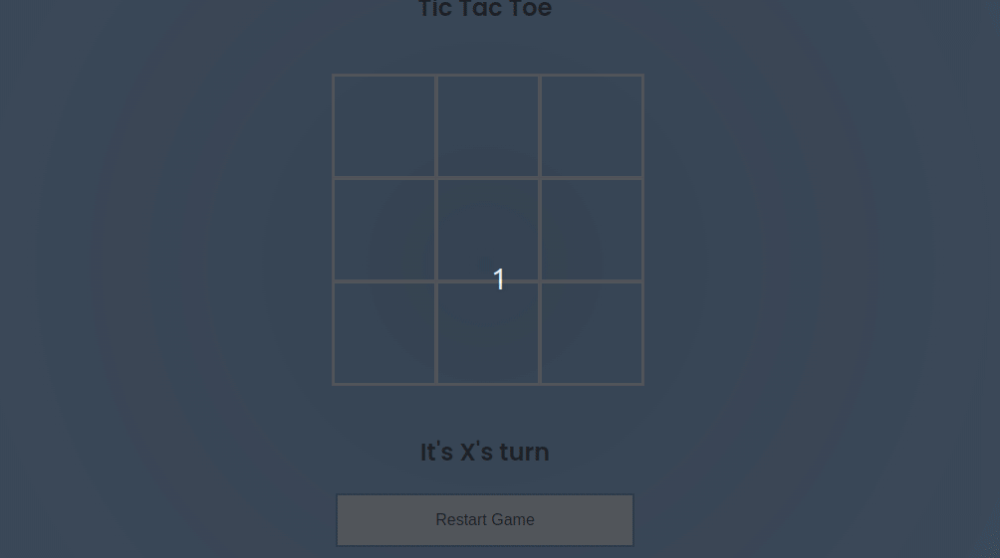

> [English version](README.md) 

# DESAFIO 01

- adicionar jogada do computador:
    - deve ser o  jogador  "O"
    - deve executar sempre depois da jogada do jogador
    - deve ser apenas jogadas válidas

[DESAFIO 02](../challenge-2/README-PTBR.md)  
[Voltar](../README-PTBR.md)